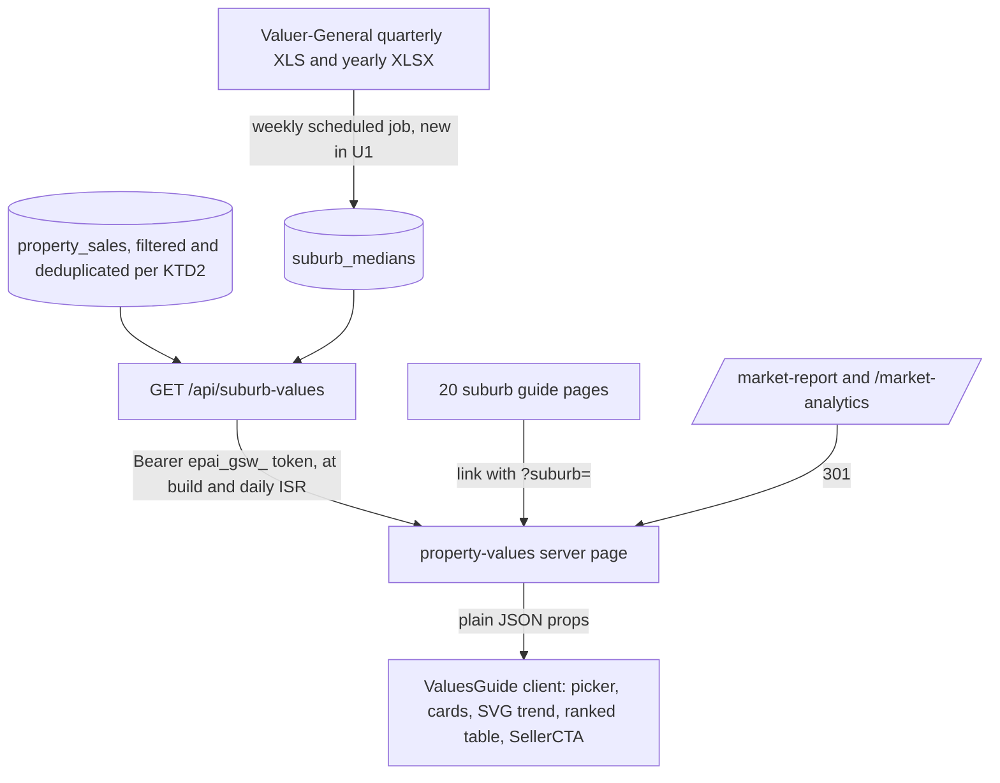

# Casey and Cardinia Property Values Guide - Plan

**Target repos:** this plan spans two repositories. U1 and U2 land in `GEA_everypropertyAI/propertyiq` (the EveryProperty API, deployed on Railway). U3 to U5 land in this repo (`GEA_website`). Paths under each unit are relative to that unit's repo.

## Goal Capsule

- **Objective:** A visitor to the GEA site can pick any suburb in the City of Casey or Shire of Cardinia and see, from real attributable data, what houses and units there are worth now and how that changed over 3 months, 12 months and 5 years, compared with every other suburb in the two councils.
- **Means:** EveryProperty computes the per-suburb series from Valuer-General Victoria medians plus its own sales table and serves it from one endpoint (KTD1, KTD2). The website renders that payload as a static, daily-refreshed page (KTD3).
- **Authority:** the no-mock-data policy (`NO_MOCK_DATA_POLICY.md`, `CLAUDE.md`) outranks every requirement here. A figure that cannot be sourced is omitted, never estimated or placeholdered.
- **Stop conditions:** stop and surface if the Valuer-General quarterly files cannot be parsed into per-suburb house and unit medians (U1), or if the EveryProperty sales table cannot supply a 10-sale deduplicated sample for the majority of suburbs (U2). Either invalidates KTD2 and needs a decision, not a workaround.
- **Execution profile:** two PRs, one per repo, U1 and U2 first. U1's ingest must have run once against production before U4's smoke test can pass. The service area is 78 suburbs (32 Casey, 46 Cardinia) per EveryProperty's `SERVICE_AREA_SUBURBS`.

---

## Product Contract

### Summary

Build a public "Property values" page modelled on the Guardian and Cotality suburb-price interactive, scoped to Casey and Cardinia. Suburb picker, headline median with 3-month, 12-month and 5-year change, a trend line, a ranked table of every suburb, houses and units shown separately, and an appraisal call to action. It replaces the two existing pages that show hard-coded figures.

### Problem Frame

The Guardian's 5 September 2026 piece on falling house prices carries a Cotality-powered interactive: type a suburb, get its median value and its 3-month, 12-month and 5-year change, and compare it with neighbours. That is the single most engaging format for local market authority, and it matches the CLAUDE.md Priority 1 strategy of suburb-level market data driving vendor leads.

The site cannot show this today. VaultRE only holds Grant's own sales, so the existing `SuburbStats` block is agency-scoped and small-sample. The two pages that promise market data, `/market-report` and `/market-analytics`, ship inline mock medians and growth figures, which breaches the no-mock-data policy and is live in the footer and header today.

The data does exist in the group's own stack. EveryProperty (`GEA_everypropertyAI`) already parses Valuer-General Victoria data, holds about 30,000 Casey and Cardinia sales, and exposes an authenticated API consumed by the CMA and CRM tools. Its scraped CoreLogic series (via Your Investment Property Magazine) is not usable on a public commercial page because Cotality licences that data.

### Requirements

**Data**

- R1. The page shows, for every suburb in Casey and Cardinia, a current median for houses and a separate median for units, sourced from real sales data.
- R2. Each suburb and property type shows percentage change over 3 months, 12 months and 5 years, each computed from the same series as R1.
- R3. Historical medians come from Valuer-General Victoria's published suburb medians (CC-BY 4.0) and the latest rolling quarter comes from EveryProperty's own sales table, per KTD2; the page attributes both sources and shows the period each figure covers.
- R4. Any figure whose underlying sample is below the threshold in KTD2 is shown as "not enough sales", never filled from another source, an estimate, or a placeholder.
- R5. The data refreshes without manual steps: a scheduled job re-ingests Valuer-General releases weekly (U1 stands this up; no such schedule runs today), and the page regenerates daily.

**Page**

- R6. The page lives at `/property-values`, lists every suburb from EveryProperty's service-area list in a searchable picker, and opens on a suburb chosen from the query string or, absent one, on the ranked table with no suburb selected. A picker or query-string value that matches no known suburb falls back to that same default state rather than erroring or showing stale data.
- R7. A selected suburb shows a headline card per property type: median, the three change figures with up and down colouring plus a non-colour direction cue (arrow or explicit sign, per WCAG use-of-colour), sample size and period label.
- R8. A selected suburb shows a trend line of its quarterly median series with the computed latest quarter visually distinguished from the Valuer-General quarters.
- R9. The ranked table lists every suburb with median and the three change figures (each with the same non-colour direction cue as R7) for the chosen property type, sortable by any change column, and each row selects that suburb.
- R10. The page carries the existing seller call to action linking to `/appraisal`, and each existing suburb guide page links to its own suburb on this page.
- R11. The page works on phone widths, follows the on.com-derived styling used across the site, and has title, description and structured data like other indexable pages.

**Retirement**

- R12. `/market-report` and `/market-analytics` are removed, their inbound links repointed, and both URLs redirect permanently to `/property-values`.
- R13. An endpoint outage never produces a page with wrong or missing numbers: a failed daily regeneration keeps the last good page, and a failed first build blocks the deploy so the previous deployment stays live (KTD3).

### Key Decisions

- **Data basis is Valuer-General medians plus EveryProperty's own sales, not the scraped CoreLogic series** (session-settled: user-directed, chosen over the CoreLogic series scraped via Your Investment Property Magazine: that series is Cotality-licensed data and cannot be republished on a commercial site; chosen over Valuer-General only: that would leave the newest figure about six months old). Governs R1, R2, R3, R4.
- **Replace the two mock-data pages rather than add alongside them** (session-settled: user-approved; chosen over leaving them in place: they breach the no-mock-data policy today). Governs R12.
- **Cover every Casey and Cardinia suburb, not only the 20 with guide pages** (session-settled: user-approved; chosen over the 20 guide suburbs: the comparison table is the feature, and a partial list reads as a gap). Governs R6, R9.
- **No coloured suburb map in the first release** (session-settled: user-approved; chosen over a Guardian-style choropleth: boundary data and a map layer roughly double the front-end work for the second-most-used part of the interactive). See Scope Boundaries.

### Success Criteria

- Every suburb on EveryProperty's service-area list appears in the table with either real figures or an explicit "not enough sales" cell; no cell is blank or estimated.
- The page's December 2025 quarter figure for Berwick houses equals the value published in the Valuer-General's December 2025 quarterly file, and the page states that period; any computed later period is shown as a separate, source-labelled figure.
- `/market-report` and `/market-analytics` return a 301 to `/property-values` on the deployed site and no internal link points at them.

### Scope Boundaries

- Rent medians, yields and demographics are out. EveryProperty has them only from the licensed scrape.
- Property-level estimates stay out; the retired `/api/properties/estimate` route is unrelated to this work.
- No email capture on this page. The seller call to action is enough; the market-report lead magnet is planned separately in the 21 August 2026 plan.

#### Deferred to Follow-Up Work

- Choropleth map of the two councils, once suburb boundary polygons are sourced (Vicmap Admin, CC-BY). The page layout should leave a natural slot above the table.
- Vacant-land medians. The Valuer-General publishes them; add as a third property type if U1 proves cheap.
- Replacing the agency-scoped `SuburbStats` block on suburb pages with a whole-market card from the same endpoint.

### Open Questions

- Deferred: exact column layout of the Valuer-General quarterly XLS and the 2014 to 2024 time-series XLSX. U1 opens with a read of both files and records the mapping. Not blocking; the datasets are confirmed to exist at suburb level.
- Deferred: how far back EveryProperty's `property_sales` goes for Casey and Cardinia. It only affects the computed latest quarter, so it does not change the design.

### Sources

- Guardian interactive, 5 September 2026: search box, headline median, 3-month, 12-month and 5-year change, choropleth. Data file fields are `Suburb`, `Median value`, `3_months`, `12_months`, `5yrs`. Source is Cotality, not reusable.
- Valuer-General Victoria, DataVic: "Victorian Property Sales Report, Median House by Suburb Quarterly" and the matching Unit and Vacant Land datasets (quarterly XLS, 15-month window per release, latest December 2025 quarter released June 2026, CC-BY 4.0); "Median House by Suburb Time Series" (XLSX, yearly 2014 to 2024, CC-BY 4.0).
- EveryProperty: `src/lib/jobs/ingest-vg-data.ts` (VIC branch parses only the yearly summary into `property_sales` as `source: 'vic-vg-aggregate'` rows with null price; not idempotent because null price never collides with the unique key), `src/lib/db/queries.ts` `getSalesForSuburb` (no source filter, default limit 200), `schema.sql` (`property_sales` unique on raw address, sale date, price, source), `src/lib/utils/service-area.ts` `SERVICE_AREA_SUBURBS`, `src/middleware.ts` Bearer-key gate, `INTEGRATIONS.md` (consumer keys; GEA_Website already holds `epai_gsw_`), `DAILY_SYNC_SETUP.md` (the `vercel.json` cron array is dead on Railway; live jobs run as Railway cron services or GitHub workflows), `src/app/api/market-segments/route.ts` (aggregation pattern, plausibility cap, minimum-sample flag).
- Website: `src/lib/serverProperties.ts` (server-only env pattern, never self-fetch own routes), `src/lib/stats.js` and `scripts/check-stats.js` (median helper plus assert self-check), `src/app/suburbs/berwick/page.tsx` (server page passing plain props to a client component), `src/components/SellerCTA.tsx`, `next.config.js` line 106 redirect for `/auction-results/:path*`.

---

## Planning Contract

### Key Technical Decisions

- KTD1. **Computation lives in EveryProperty; the website is a read-only consumer using its existing key.** The Valuer-General rows and the sales table are already in EveryProperty's Supabase, and the CMA and CRM tools consume it the same way. `INTEGRATIONS.md` already lists a GEA_Website consumer key (`epai_gsw_` prefix) on the Railway allowlist that the website never wired up; reuse it rather than minting a second key. Website env names follow that document: `EVERYPROPERTY_API_URL` and `EVERYPROPERTY_API_TOKEN`, server-only. (Inherits the session-settled data-basis Key Decision; cites R1 to R4.)
- KTD2. **Series composition and the definition of a sale.** Per suburb and property type: quarterly medians from the Valuer-General quarterly files, back-filled from the yearly time series for any period with no quarter row at any date (not only before 2020), plus one computed "latest period" from EveryProperty's `property_sales` covering the most recent 90 days. A sale for that computation is a row with a price above zero and at or below the plausibility cap used in `market-segments`, with source not `vic-vg-aggregate`, deduplicated on address slug plus sale date within a 120-day window (preferring the `vic-vg` row's price when both exist) so the same sale from Domain and the Valuer-General counts once. The computed period needs at least 10 such sales; count and median use the same filtered set.

  **Calibration gate (session-settled: user-directed — chosen over shipping without it: the adversarial review found the computed period draws from a different, portal-skewed population than the official register, so an unchecked computed figure can show false movement).** For the newest quarter where both a Valuer-General quarter and a computed period exist, compare their medians per suburb and property type. If they diverge by more than 10 percent, the computed period is demoted: it is not used as "latest", and its reason becomes `low-agreement`. This check runs once per suburb/type pair using the most recent overlapping quarter, not every historical period.

  **Change figures use the actual period pair, not a fixed label (session-settled: user-directed — chosen over a fixed "3-month" label: the adversarial review found the computed period is 90 days but the newest official quarter is six-plus months old, so calling that comparison "3-month" mislabels a two-to-three-quarter movement).** The short-term change is latest period versus the most recent earlier period in the series; the payload carries both period labels, and the website renders it as "vs {prior period}" (e.g. "vs Dec 2025 qtr"), using the literal "3-month" label only when the two periods are consecutive quarters. 12-month is latest versus the same quarter a year earlier; 5-year is latest versus the closest available period five years earlier.

  When the computed period is unavailable, thin, or fails the calibration gate, the latest Valuer-General quarter becomes "latest" and the short-term figure computes between Valuer-General quarters. Every null or demoted figure carries a reason: `suppressed` (the Valuer-General published no median for that period), `unmatched` (no Valuer-General row for the suburb despite priced sales existing in `property_sales`, signalling a name mismatch), `no-data` (no Valuer-General row and no priced sales at all, a genuinely tiny locality), `thin-sample` (fewer than 10 qualifying sales), or `low-agreement` (failed the calibration gate).
- KTD3. **Website fetches server-side only, dynamically rendered with a one-day cached fetch, never at build (session-settled: user-directed — chosen over build-time prerendering: the feasibility review found that prerendering couples every website deploy to EveryProperty's uptime, since a failed build blocks the whole site; a dynamic route with a cached fetch isolates an outage to this one page while the rest of the site deploys normally).** The route is not statically generated; the server page fetches with `next: { revalidate: 86400 }` so Next's data cache serves the cached payload for up to a day between origin hits. The server page never reads `searchParams` — the client component reads `?suburb=` via the client-side search-params hook inside a Suspense boundary, so the route stays server-rendered-with-cache rather than becoming fully dynamic on every request (feasibility review). The token is read from server env and never exposed to the client, following `serverProperties.ts`'s env pattern but not its catch-and-return-empty behaviour, which would let an outage replace good numbers with an empty page. On a non-OK response or an unexpected `schemaVersion` the fetch throws: the cached payload keeps serving from the data cache while the origin is down, satisfying R13 without blocking deploys. Missing env returns null before any network call and renders a configuration-error state, which is a deploy mistake, not an outage.
- KTD4. **Chart is an inline SVG polyline with no dependency.** The repo has no chart library and one series per property type does not justify one. About 20 lines of markup.
- KTD5. **Routing and retirement.** New route `/property-values`. Permanent redirects for `/market-report` and `/market-analytics` in `next.config.js`, and the existing `/auction-results/:path*` redirect repointed to `/property-values` so no chain forms. Both mock page directories are deleted, not stubbed.
- KTD6. **The suburb universe comes from the API response, not a website list.** EveryProperty's `SERVICE_AREA_SUBURBS` is the authority for "every Casey and Cardinia suburb". The website renders whatever suburbs the payload contains, so a change in EveryProperty propagates without a website release.
- KTD7. **Change and ranking maths lives in a plain JS module with an assert self-check**, mirroring `src/lib/stats.js` and `scripts/check-stats.js`. This is the one non-trivial logic path on the website side and the check is the runnable proof.
- KTD8. **The payload carries an integer `schemaVersion`.** Two repos deploy independently and the website caches for a day. A version field checked by the website turns a breaking API change into a failed revalidation (last good page stays) instead of a page of wrong numbers. Additive fields do not bump it. A path version is heavier than one consumer needs.

### High-Level Technical Design

Payload shape, directional only: `schemaVersion`, `generatedAt`, an attribution block, and a `suburbs` array where each entry carries `name`, `slug`, and for each of `houses` and `units` a `latest` object (median, periodStart, periodEnd, sales, source), the three change numbers, a `reason` wherever a figure is null (KTD2), and the ordered `series` of periods. One request returns everything; 78 suburbs by two types by roughly 30 periods is a few hundred kilobytes fetched once a day by one server, so there is no per-suburb fetch.

### Assumptions

None carried; every inferred scope item was confirmed in the scoping and data-source questions.

### Sequencing

U1 then U2 in EveryProperty, and U1 must complete one production run before U4 is verified. U3 can start in parallel against the payload shape above. U4 depends on U2 being deployed and U3. U5 last.

---

## Implementation Units

### U1. Valuer-General suburb medians table, ingest and schedule

**Goal:** EveryProperty stores per-suburb, per-quarter and per-year house and unit medians from the Valuer-General files in a dedicated table, refreshed weekly by a job that actually runs.
**Requirements:** R1, R3, R5
**Dependencies:** none
**Files:** `propertyiq/src/lib/jobs/ingest-vg-data.ts` (extend the VIC section), new `propertyiq/src/lib/jobs/vg-suburb-medians.ts` (XLS parsing, batch gate, row mapping), `propertyiq/package.json` (add the `xlsx` (SheetJS) dependency — the existing VIC branch is a line-split CSV parser, not a spreadsheet reader), new migration `propertyiq/src/lib/db/migrations/014_suburb_medians.sql` (add to `propertyiq/src/lib/db/schema.sql` too), a new dedicated `propertyiq/src/app/api/cron/vg-suburb-medians/route.ts` scheduled action (kept separate from the combined NSW/VIC/WA ingest so a WA or NSW failure cannot mask a medians-ingest failure) plus a Railway cron service or scheduled GitHub workflow following `.github/workflows/nightly-sale-attrs-backfill.yml` that calls it weekly, `propertyiq/DAILY_SYNC_SETUP.md` (record the job), `propertyiq/src/data/casey-cardinia.ts` and `src/lib/utils/service-area.ts` (scope), tests beside the parser under the repo's `__tests__` convention.
**Approach:**
1. Read the three quarterly datasets (house, unit, vacant land) and the yearly time-series XLSX once, record the column mapping in the parser file header, and confirm Casey and Cardinia suburb names match `SERVICE_AREA_SUBURBS` (watch for abbreviations such as "Sth" or "Nth").
2. Create `suburb_medians`: suburb (stored canonical via `normaliseSuburbAlias`), property type, period type (`quarter` or `year`, check-constrained), period start, all four NOT NULL and unique together; nullable median with a check that it is null or above zero; nullable published sales count; source URL; fetched-at. Upsert on that key with merge, not ignore-duplicates, because the Valuer-General revises figures.
3. Parse the whole file in memory and gate the batch before any write: abort the run, log and leave the table untouched if service-area suburb hits fall well below the previous run, any median is outside a plausibility band, or the period column fails to parse. Never delete rows; a bad file can only touch the keys it contains and rollback is re-running against the previous file URL, which the source URL column records.
4. Filter to service-area suburbs only, per the Casey and Cardinia-only policy.
5. Retire the legacy `vic-vg-aggregate` write into `property_sales`: it appends duplicate rows every run (null price never collides with the unique key) and its only reader is the crawl-status admin route. Repoint that reader to `suburb_medians`.
6. Schedule the job. The `vercel.json` cron array is dead because the app runs on Railway (the route exports both GET and POST; the verb was never the issue), so nothing runs today. Add a Railway cron service or a scheduled GitHub workflow that calls the new dedicated medians-only route with `CRON_SECRET` weekly, kept separate from the combined `ingest-vg` route so its own row count and gate result are directly observable.
**Patterns to follow:** the existing VIC branch's dataset-page scrape for the download link; `MIN_SALES_FOR_SUFFICIENT_DATA` in `market-segments/route.ts`; the Railway cron and GitHub workflow patterns named in `DAILY_SYNC_SETUP.md`.
**Test scenarios:**
- A fixture XLS row set with Berwick house, Berwick unit and an out-of-area suburb produces two `suburb_medians` rows and drops the third.
- A row where the Valuer-General leaves the median blank (suppressed) stores null median and the published sales count, not zero.
- Re-running ingest on the same file changes no row count and advances fetched-at on every row (merge path ran).
- A revised figure in a later file replaces the earlier median for the same key.
- A suburb spelled "Narre Warren Sth" in the file is stored as "Narre Warren South".
- The yearly time series for 2014 to 2024 produces year-type rows and does not overwrite quarter-type rows for the same suburb.
- A fixture file missing 30 percent of expected suburbs writes nothing and logs the abort.
- Download failure logs and leaves the table unchanged.
- After the change, a run adds zero rows with source `vic-vg-aggregate` to `property_sales`.
**Verification:** after one scheduled run in production, the queries in the Verification Contract all hold, and the run is visible in the job's log.

### U2. `GET /api/suburb-values` endpoint

**Goal:** One authenticated endpoint returns the full Casey and Cardinia values payload with computed latest quarter, change figures and reasons.
**Requirements:** R1, R2, R3, R4, R5
**Dependencies:** U1
**Files:** new `propertyiq/src/app/api/suburb-values/route.ts`, new `propertyiq/src/lib/values/suburb-values.ts` (series assembly, sale filter, dedupe, calibration gate, change maths), `propertyiq/src/middleware.ts` (add the route to the gated matcher), `propertyiq/src/lib/db/queries.ts` (bulk queries: all service-area `suburb_medians` rows, and all `property_sales` in the last 90 days for service-area suburbs, both paginated with the existing `PAGE = 1000` / `.range()` loop already used at four call sites in this file, not a per-suburb loop with the 200-row default limit), `propertyiq/INTEGRATIONS.md` (add the endpoint to the GEA_Website section), tests beside `suburb-values.ts`.
**Approach:**
1. Load all service-area suburbs, their `suburb_medians` rows, and the 90-day sales window in bulk (paginated), classifying house or unit with the existing classifier from `market-segments`.
2. Apply the sale definition and dedupe from KTD2, run the calibration gate against the newest overlapping Valuer-General quarter, then assemble the series and change figures using the actual period pair for the short-term comparison, attaching a reason to every null or demoted figure.
3. Emit the payload described in High-Level Technical Design with `schemaVersion`, `generatedAt` and attribution text for both sources.
4. Apply `PUBLIC_GET_CACHE_HEADERS` and CORS the same way `market-segments` does. Confirm the `epai_gsw_` key is present on the Railway service; no new key.
**Patterns to follow:** `market-segments/route.ts` for aggregation and the plausibility cap; `vendor-report/route.ts` for the middleware-gated consumer-key model.
**Test scenarios:**
- Berwick with six Valuer-General quarters and 25 recent priced house sales whose median agrees with the December 2025 quarter within the calibration band returns a computed latest period labelled with the sales source, period range, and a short-term change against the December 2025 quarter labelled "vs Dec 2025 qtr".
- A computed period whose median diverges from the newest overlapping Valuer-General quarter by more than 10 percent is demoted: not used as latest, reason `low-agreement`.
- Twelve rows in the window of which four are aggregate or null-price rows return `thin-sample`, not a computed period.
- The same Berwick sale present from `domain` and `vic-vg` sources within a 120-day window counts once toward the 10-sale floor and the median, using the `vic-vg` price.
- A suburb with 4 recent sales falls back to the December 2025 quarter as latest and computes the short-term change between the two newest Valuer-General quarters.
- A suburb with a suppressed December 2025 quarter returns a null short-term change with reason `suppressed`.
- A suburb with no Valuer-General row but priced sales in `property_sales` returns reason `unmatched`.
- A suburb with no Valuer-General row and no priced sales at all returns reason `no-data`.
- 5-year change uses the 2021 year row when no 2021 quarter exists.
- A sale above the plausibility cap is excluded.
- A `suburb_medians` fixture of more than 1000 rows still produces a series for every suburb (pagination proof).
- Request without a Bearer key returns 401; with the website key returns 200, `schemaVersion` present, and the suburb count equals the service-area list length.
**Verification:** curl against Railway with the website key returns all 78 suburbs, no suburb has reason `unmatched` for houses (genuine name mismatches are resolved; `no-data` on tiny localities is expected), Berwick houses show a median and three labelled change figures, and response time is under two seconds warm.

### U3. Website values data module and maths self-check

**Goal:** The website can fetch the payload server-side and format, rank and sort it, with the maths proven by a runnable check.
**Requirements:** R2, R9, R13
**Dependencies:** none (builds against the payload shape; integration proved in U4)
**Files:** new `src/lib/valuesGuide.ts` (server fetch, env `EVERYPROPERTY_API_URL` and `EVERYPROPERTY_API_TOKEN`, schema-version check), new `src/lib/valuesMath.js` (percent formatting, ranking, sort, period labels, reason text), new `scripts/check-values-math.js`, `package.json` (add the check to the existing check scripts if one groups them), `.env.example` if present.
**Approach:**
1. Follow the `serverProperties.ts` env and headers pattern: server-only env, return null when env is missing, one shared headers object, direct external call. Throw on a non-OK response or an unexpected `schemaVersion` (KTD3); do not copy the catch-and-return-empty behaviour.
2. Keep maths in plain JS with JSDoc so the assert script can require it, exactly like `stats.js`.
**Patterns to follow:** `src/lib/serverProperties.ts`, `src/lib/stats.js`, `scripts/check-stats.js`.
**Test scenarios (in the check script):**
- Ranking by 12-month change puts nulls last regardless of sort direction.
- Percent formatting renders 5.14 as "+5.1%" with an up cue, -4.1 as "-4.1%" with a down cue (non-colour, per R7/R9), and a null with any reason as its reason text ("not enough sales", "not published for this suburb", "no data available", "figure under review").
- Period label for a Valuer-General quarter reads "Dec 2025 quarter" and for a computed period reads the day range; the short-term change column label reads "vs {prior period}" rather than a fixed "3-month" unless the two periods are consecutive quarters.
- Sorting the table by 3-month then by 5-year is stable for ties.
- Fetch with missing env returns null without calling the network; a 500 from the endpoint throws; a payload with an unexpected `schemaVersion` throws.
**Verification:** the check script passes, and `npm run typecheck` is clean.

### U4. `/property-values` page

**Goal:** The public page with picker, headline cards, trend line, ranked table and seller call to action.
**Requirements:** R6, R7, R8, R9, R10, R11, R13
**Dependencies:** U2 deployed and U1 run once in production, U3
**Files:** new `src/app/property-values/page.tsx` (server component, `revalidate = 86400`, metadata, structured data via `src/lib/jsonLd.ts` helpers), new `src/app/property-values/ValuesGuideClient.tsx`, new `src/components/TrendLine.tsx` (inline SVG, KTD4), reuse `src/components/SellerCTA.tsx` and `OncomHeader`, `src/app/sitemap.ts` (add the route).
**Approach:**
1. Server page fetches via U3 with `next: { revalidate: 86400 }` (KTD3) and does not read `searchParams`. A null (missing env) renders the configuration-error state; a throw serves the cached payload while the origin is down. Otherwise pass the payload to the client component.
2. Client component reads `?suburb=` with the client-side search-params hook, rendered inside a `<Suspense>` boundary in `page.tsx` so the route stays cache-eligible (KTD3). An unmatched or malformed suburb value falls back to the R6 default state. Client component owns three pieces of state: selected suburb, property type toggle, table sort. Picker is a text input filtering the suburb list with a native `datalist` before reaching for a custom dropdown.
3. Headline cards, trend line and table read from the same payload; no client fetches.
4. Attribution and "data as at" line under the table, per R3.
5. Match the site's viewport padding and Helvetica Neue conventions; check `docs/BRAND_STYLE_GUIDE.md` and run `npm run style-check`.
**Execution note:** smoke-first. Render the page against the live endpoint before polishing; the design is settled, the data plumbing is the risk.
**Patterns to follow:** `src/app/suburbs/berwick/page.tsx` for server-to-client props; `src/app/buy/page.tsx` for filter and sort UI conventions; `src/components/SuburbStats.tsx` for the card typography.
**Test scenarios:**
- Opening `/property-values?suburb=pakenham` shows Pakenham selected with house cards and the table row highlighted.
- Opening `/property-values` with no query shows the table and no headline card.
- Toggling to units re-renders cards, trend and table from the unit series without a network call.
- A suburb whose unit figures are all null shows "not enough sales" in the cards and the trend line is not drawn.
- Clicking a table header sorts by that change column and clicking again reverses it.
- Typing "narre" in the picker lists Narre Warren, Narre Warren East, Narre Warren North and Narre Warren South.
- The computed latest quarter point on the trend line is visually distinct and labelled with its source.
- At 375px width the cards stack, the table scrolls horizontally inside its own container, and tap targets are at least 44px.
- With the endpoint down after a successful prior fetch, the page continues serving the cached payload rather than erroring.
- With env unset, the page renders the configuration-error state and no numbers.
- A malformed `?suburb=xyz` falls back to the ranked-table default state rather than erroring.
- `npm run build` output lists `/property-values` as server-rendered with cache, not statically prerendered and not fully dynamic.
**Verification:** page builds under `npm run build`, a Playwright smoke in `tests/` loads the page and asserts a Berwick median is present, and Lighthouse mobile accessibility is 90 or above.

### U5. Retire mock pages, redirects and links

**Goal:** No mock market data remains reachable and all inbound links land on the new page.
**Requirements:** R10, R12
**Dependencies:** U4
**Files:** delete `src/app/market-report/` and `src/app/market-analytics/`; `next.config.js` (two new permanent redirects, repoint the `/auction-results/:path*` entry); `src/components/OncomFooter.tsx`, `src/components/OncomHeader-enhanced.tsx`, `src/app/help/page.tsx`, `src/app/page-oncom-style.tsx` (repoint links); each suburb guide client component's stats section (add the "See how {suburb} compares" link with the suburb query); `public/sitemap.xml` and `scripts/generate-sitemap.js` if the old routes are listed.
**Approach:** delete first, then fix every reference the build reports, then grep once more for both old paths. Add the suburb link to both `src/components/SuburbStats.tsx` (covers the five rich suburb pages that import it) and `src/app/suburbs/[suburb]/page.tsx` (covers the other fifteen, which render `SuburbPageClient` without `SuburbStats`).
**Patterns to follow:** the existing `/auction-results/:path*` redirect entry in `next.config.js`.
**Test scenarios:**
- `/market-report` and `/market-analytics` respond 301 to `/property-values` in a local production build.
- `/auction-results/anything` responds with a single 301 to `/property-values`, not a chain.
- A grep for the route forms `/market-report` and `/market-analytics` as href or path strings across `src/`, `public/` and `next.config.js` returns only the redirect entries; the `market-report` lead type in `src/app/api/lead/route.ts` and the guide id under `src/app/guides/` are unrelated and stay.
- The Berwick suburb page contains a link to `/property-values?suburb=berwick`.
**Verification:** `npm run build` succeeds with the two directories gone and the sitemap contains the new route and neither old one.

---

## Verification Contract

| Check | Command | Applies to |
|---|---|---|
| Website types | `npm run typecheck` | U3, U4, U5 |
| Website lint and style | `npm run lint` and `npm run style-check` | U4, U5 |
| Website build with ISR | `npm run build` | U4, U5 |
| Values maths self-check | `node scripts/check-values-math.js` | U3 |
| Page smoke | Playwright spec in `tests/` against `npm run dev` | U4 |
| EveryProperty unit tests | the repo's existing test runner over the new `__tests__` files | U1, U2 |
| Endpoint live check | curl with the website key against Railway | U2 |
| Redirects | curl `-I` on both old paths in a production build | U5 |

U1 post-run queries against production, all of which must hold:

- Row count equals the count of distinct (suburb, property type, period type, period start).
- Zero rows whose suburb is outside `SERVICE_AREA_SUBURBS` by exact match, read from `propertyiq/src/lib/db/schema.sql`.
- For Berwick, Pakenham and Cranbourne, house and unit: one quarter row at the December 2025 period start and eleven year rows for 2014 to 2024.
- Every row with a null median has a published sales count or the file's suppression marker; no row has a median of zero.
- A second run leaves the row count unchanged and advances the maximum fetched-at.
- `property_sales` rows with source `vic-vg-aggregate` stop growing after the legacy write is retired.

No mock data at any layer: a test fixture is fine inside a test file; a fixture wired into a page or route is a policy breach.

---

## Definition of Done

- All five units merged, EveryProperty deployed to Railway with the weekly ingest job scheduled and observed running once, website deployed on Vercel with `EVERYPROPERTY_API_URL` and `EVERYPROPERTY_API_TOKEN` set as server-only variables.
- `/property-values` shows all 78 service-area suburbs; Berwick, Pakenham, Cranbourne, Officer and Clyde North show real house medians with three change figures.
- Both old URLs redirect; no internal link to them remains; sitemap updated.
- The maths self-check and EveryProperty tests pass; `npm run build` is clean.
- Attribution to Valuer-General Victoria (CC-BY 4.0) and EveryProperty is visible on the page.
- `INTEGRATIONS.md` and `DAILY_SYNC_SETUP.md` in EveryProperty record the endpoint and the job.
- No abandoned experiment code remains in either diff, and no fallback or sample data exists in any route or page.
- `CLAUDE.md` known-issues list updated to remove the mock market pages.

---

## Risks

- **Valuer-General lag.** The newest official quarter is about six months old. Mitigated by the computed latest quarter (KTD2) and by labelling every period. If the sales table turns out thin for many suburbs, the page is honest but older; that is acceptable under R4.
- **Sales table coverage and duplication.** `property_sales` is portal-scraped, not a complete register, and holds the same sale under different address strings from up to four sources. The KTD2 sale definition (priced, plausible, not aggregate, deduplicated on address slug plus price) and the 10-sale floor limit the skew; the label makes the source clear.
- **File format drift.** The Valuer-General XLS layout can change between releases. The U1 pre-write batch gate aborts the whole run rather than writing partial or wrong rows, the previous rows stay, and Supabase point-in-time recovery is the backstop.
- **Name mismatches.** Valuer-General suburb spellings versus `SERVICE_AREA_SUBURBS`. U1 canonicalises at write time and tests the known abbreviations; anything left surfaces as reason `no-data` in the U2 live check, which must be clean before U4 is verified.
- **Schedule drift.** Nothing runs the Valuer-General ingest today despite the cron entry in `vercel.json`. U1 owns standing up a real schedule and the Definition of Done requires one observed run.
- **Key handling.** The website token must stay server-side. KTD3 and the `serverProperties.ts` env pattern enforce it; never read it in a client component.
